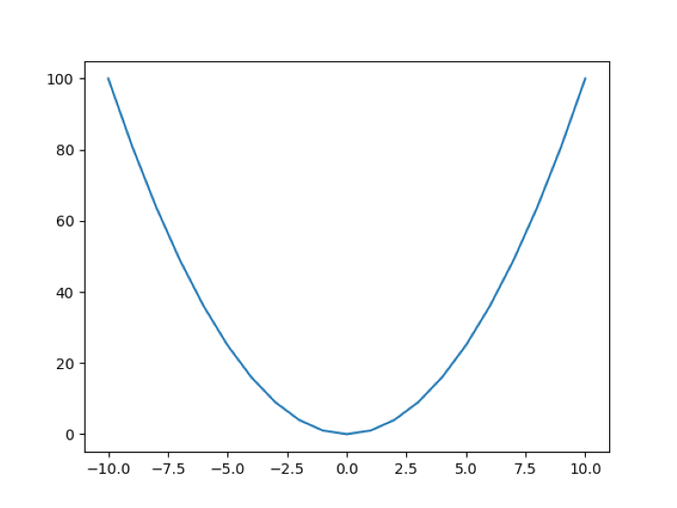
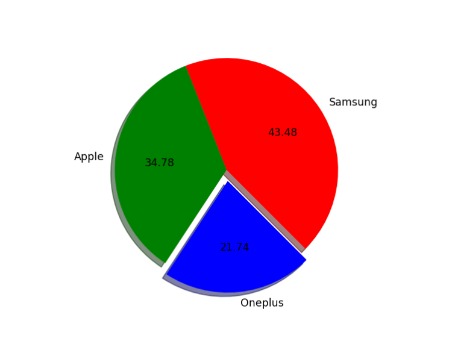

# python-learning
A collection of Matplotlib basics and practice and exercises.

# Topics Covered
- matplotlib introduction 
  Plotting x=y^2 and Plotting sin and cos plots using the matplotlib module.
  
  
  

- matplotlib barplot
  Comparing salaries in two different job fields based on age using the Matplotlib module

  

 - matplotlib piechart
   Displaying the sales of 3 different brands in a piechart using the matplotlib module.

   
   
