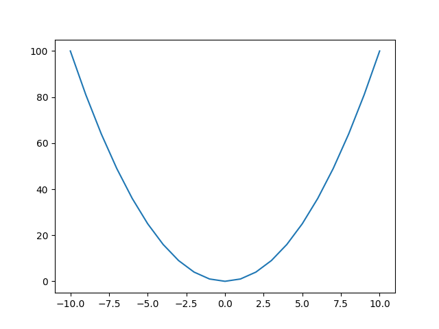
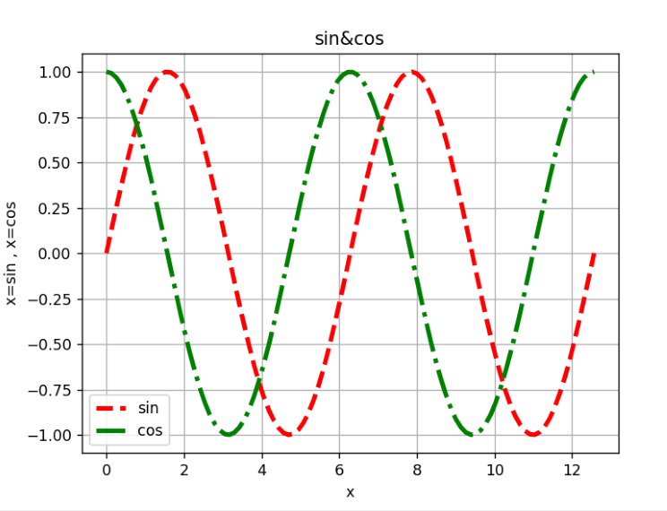

# python-learning
A collection of Matplotlib basics and practice and exercises.

# Topics Covered
- matplotlib introduction 
  Plotting x=y^2 using the matplotlib module and Ploting sin and cos plots using matplotlib.
  
  
  
