# Statistics
Concepts of exercises related to descriptive statistics and data description

# Topics Covered
- [calculations related to mean, median, mode ,trim mean , and STD.](statistics-basics.py)
  
 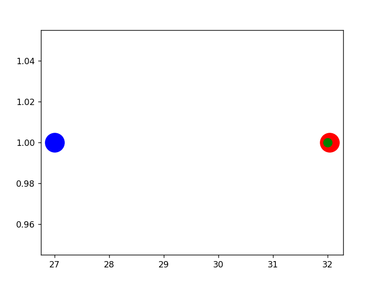

 
- [The usage of COV (coefficient of variation) to STD.](calculating-COV.py)

  
- [Standard normal distribution concept.](normal-Distribution.py)

 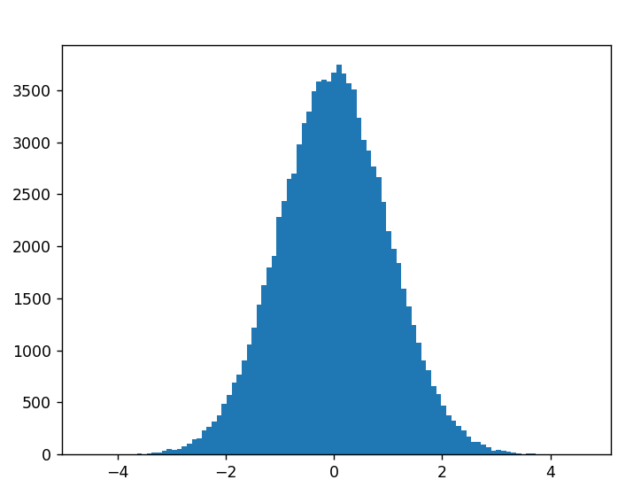
 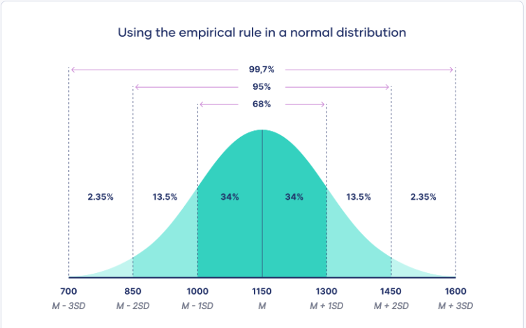

  
- [Checking consepts of skewness and kurt.](skewness&kurt-Consepts.py)

 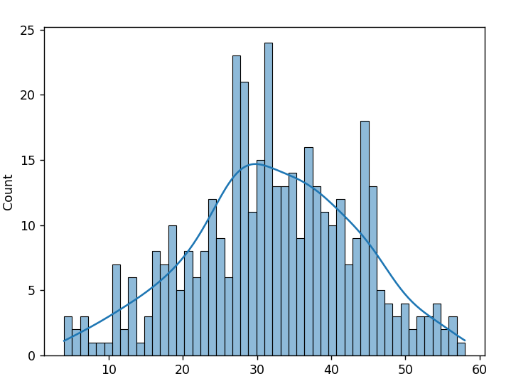
 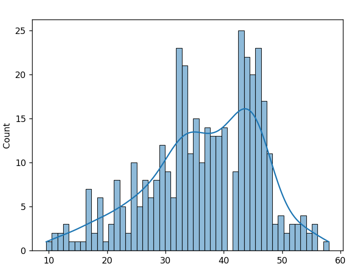

- [Checking consepts of Quartile and interquartile range (IQR).](quartile&IQR-Consepts.py)

 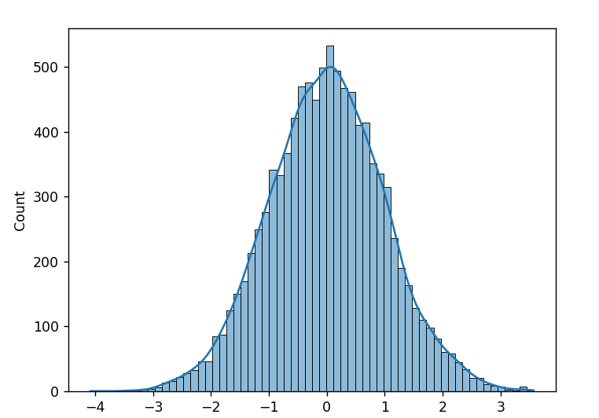
 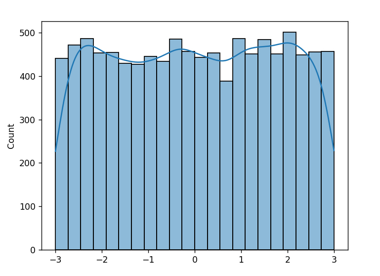
 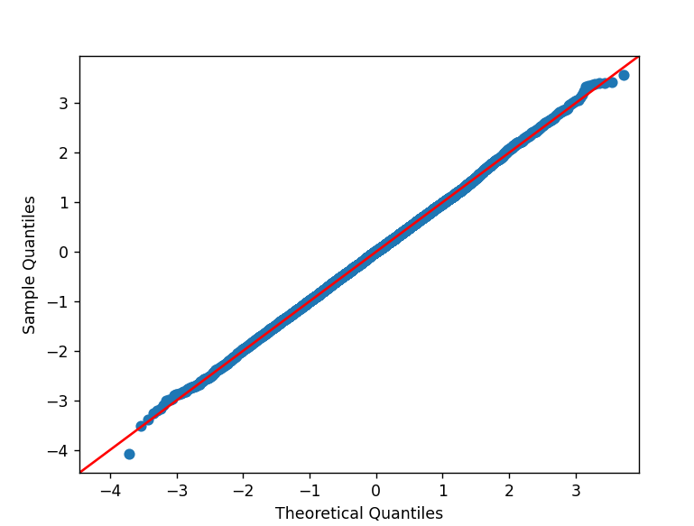
 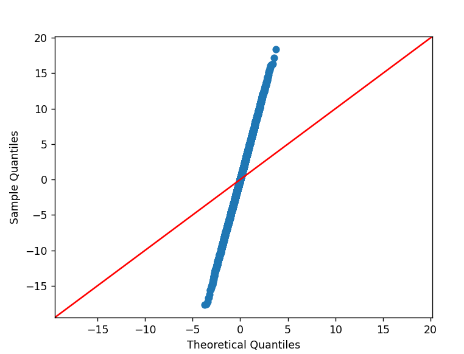
 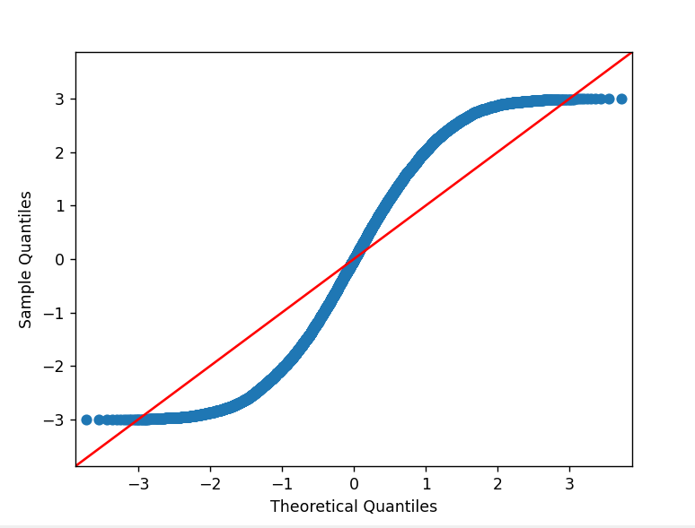
 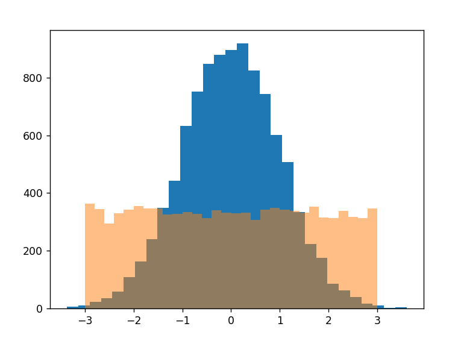

- [Comparison two statistical samples using qqplot and qqplot2samples tools.](qqplot&qqplot2samples_comparison.py)

  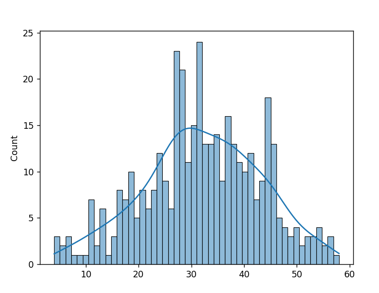
  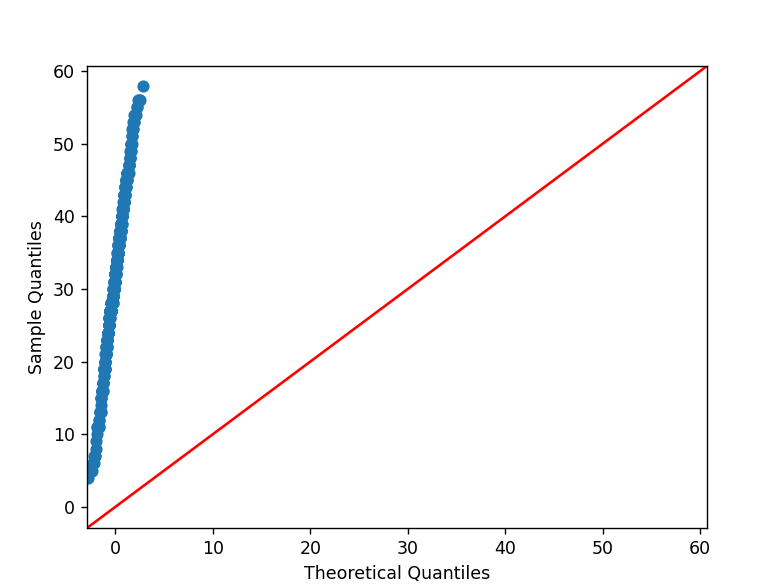
  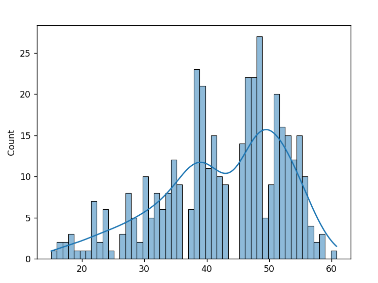
  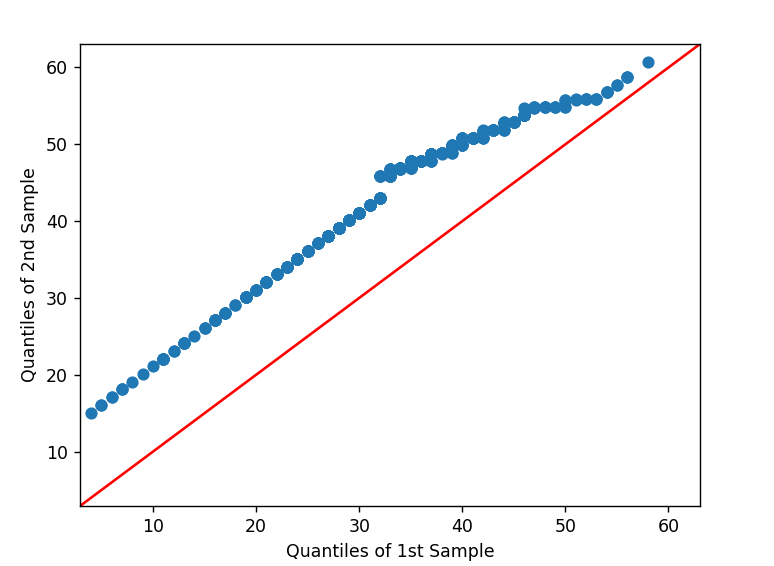
  
 
